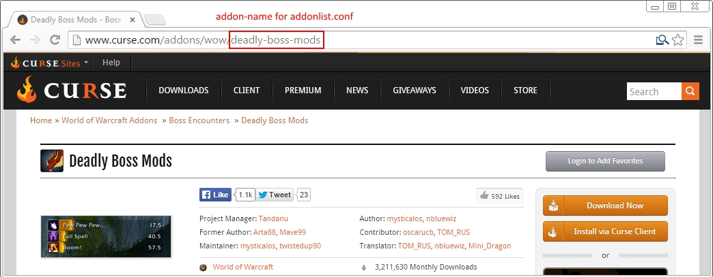

# NiraCurse
A Shell-based curse client to update your wow-addons.

## What's new in v2.0?
- [add] PlugIn support!!! (see README.md)
- [add] PlugIn for ZygorGuide Gold Data updater
- [add] initialising and checking for folder and files are needed
- [changed] moved addonlist into the addon-folder (now you can change your addons remotely)
- [changed] now all config-files are commentable! (f.e. add a # in front of an addon and it wouldn't update anymore!)
- [fix] various smaller problems and bugs

## Requirements
* xargs
* wget
* zip
* unzip
* (tested on Ubuntu Server 14.04 LTS)

## How to install
1. You have to install all packages named above in "Requirements"
2. Move all files to your preferred install location
3. Create 3 dirs for temporary files (tmp), wow-addons (addons) and backups (backup)
4. Change the 3 paths to the tmp, addons and backup folder in settings.conf
5. Move all files out of "addons" into your own addon-folder!
6. Make sure that all *.sh files are executable

## How to use
1. Edit the "_nc_addonlist.conf" and add for each line your preferred addon.
Visit http://www.curse.com/addons/wow/ and click on your addon. Now you can see the correct name of the addon in the adressbar.
F.e. DBM will be "deadly-boss-mods" because of "http://www.curse.com/addons/wow/deadly-boss-mods"
2. run `./NiraCurse.sh` and enjoy :)

## How to update
1. Copy your old "settings.conf" to a safe location
2. Overwrite the old files with the newest ones (exclude addon- and backup-folder!)
4. For "settings.conf" edit the new one and change all what you need (may you have to watch into the old, copied file)

## How to add/activate/deactivate a PlugIn
1. Copy all PlugIn-files into the "plugin"-folder
2. open "_nc_pluginlist.conf" (in your addon-folder) and add/comment/uncomment the start script for the PlugIn
3. make all added "*.sh"-files executeable

## [PlugIn] How to use Gold-Data updater
Simply edit the "_nc_plugin_zygorAhData_serverlist.conf" in your addon-folder and uncomment the servers of your need.

Please be patient to uncomment just your servers and not all. This is a free project and we won't produce extra costs for other services. Otherwise buy premium to support their developer.

## Important
You have to support Curse! So [buy premium](http://www.curse.com/premium) before using NiraCurse!
I'm not responsible for any damage caused or whatever can happen like a tornado or a nuclear disaster!

## Licensing
This program is published under the terms of the GNU GPL v3 excluding a commercial/profit-oriented use. If you want to use this framework in a commercial context you have to buy an individual license. Therefore please contact the administrator of this repository.